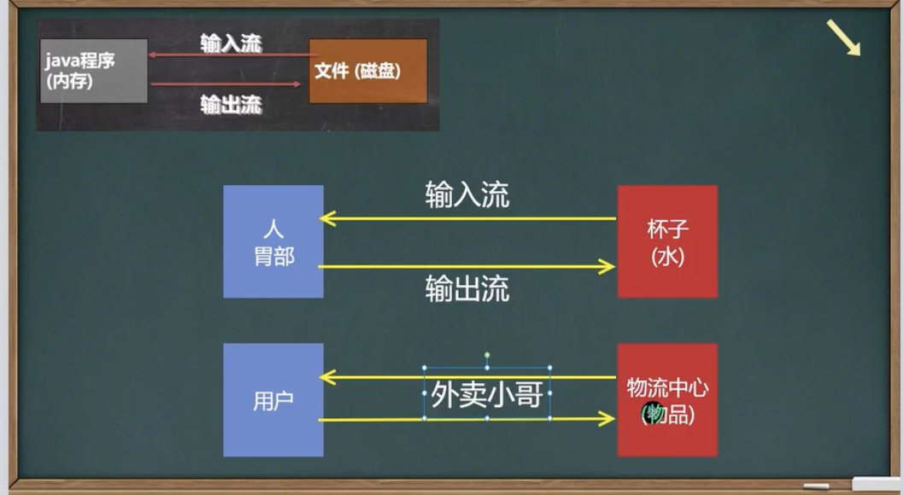

# 介绍

​	I/O是Input/Output的缩写，I/O技术是非常实用的技术，用于处理数据传输。如读写文件，网络通讯等

# 流的分类

| 抽象基类 |    字节流    | 字符流 |
| :------: | :----------: | :----: |
|  输入流  | InputStream  | Reader |
|  输出流  | OutputStream | Writer |

> 抽象类：我不能被new实例化哟～

* 按操作数据单位不同分为：字节流（8 bit）二进制文件，字符流（按字符）
* 按数据流的流向不同分为：输入流，输出流
* 按流的角色的不同分为L：节点流，处理流/包装流