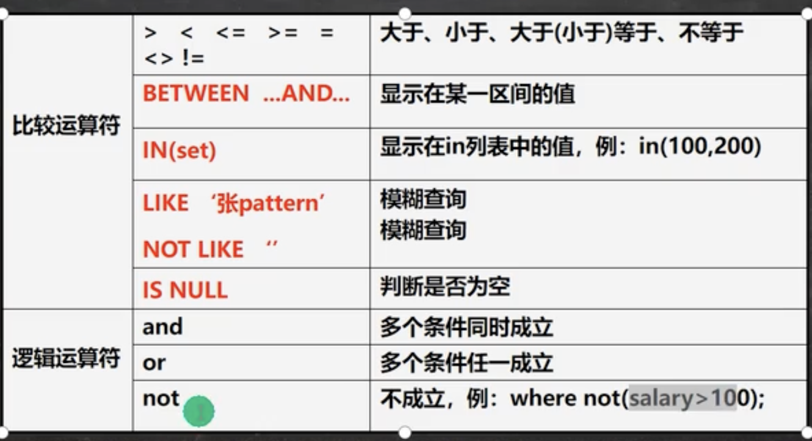

# 介绍

```mysql
-- 基本
SELECT [DISTINCT] * | {column1, column2, column3 ..}
FROM tablename;

-- 表达式
SELECT * | {column1 | expression, column2 | expression, ..}
FROM tablename;

-- as
SELECT column_name as 别名 FROM 表名

-- order by
SELECT column1, column2, column3...
FROM tablename
ORDER BY column asc|desc ...

-- 统计函数 count
SELECT count(*) | count(列名)
FROM tablename
[WHERE where_definition]

-- 合计函数 sum 仅对数值起作用
SELECT sum(列名) {, sum(列名)...}
FROM tablename
[WHERE where_definition]

-- 平均函数 avg 仅对数值起作用
SELECT avg(列名) {, avg(列名)...}
FROM tablename
[WHERE where_definition]

-- max/min 仅对数值起作用
SELECT max|min(列名) {, max|min(列名)...}
FROM tablename
[WHERE where_definition]

-- 分组
SELECT column1, column2, column3 ...
FROM tablename
GROUP BY column1, column2, ..

-- 分组过滤
SELECT column1, column2, column3 ...
FROM tablename
GROUP BY column1, column2, .. HAVING
```


# Where子句




# Order by子句

* 指定排序的列，排序的列可以是表中的列名，也可以是select语句后指定的列名
* ASC 升序[默认]、 Desc 降序
* ORDER BY 子句应位于SELECT语句的结尾


# count(*) 和 count(列) 区别

* count(*)：返回满足条件的记录的行数
* count(列)：统计满足条件的某列有多少个，但是会排除null