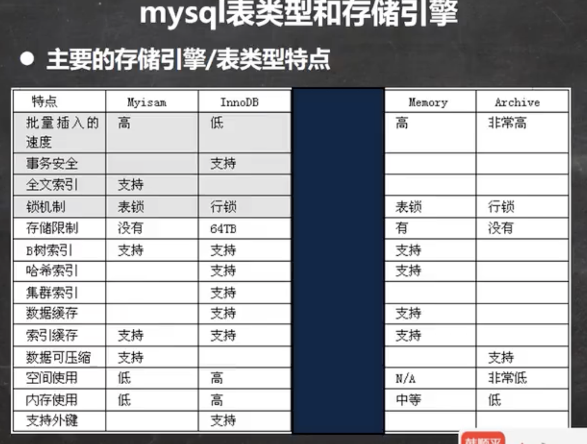

# 介绍

* MyISAM
  * 不支持事务
  * 不支持外键
  * 但是访问速度快，对事务完整性没要求
* InnoDB
  * 具有提交、回滚和奔溃恢复能力的事务安全
  * 相比比MyISAM，写的处理效率要差一些并且会占用更多的磁盘空间以保留数据和索引
* MEMORY
  * 使用存在内从中的内容来创建表
  * 每个MEMORY表实际对应一个磁盘文件
  * MEMORY类型的表访问速度非常的快，因为它的数据存在内容中，并且默认使用HASH索引
  * 一旦服务关闭，表中的数据就会丢失掉，但表的结构还在




# 操作

```mysql
# 设置引擎
create table t1(
  id int,
  `name` varchar(32)
) engine myisam

# 修改索引
alter table tab_name engine = 存储引擎;
```


# 如何选择？

* 如果你的应用不需要事务，处理的只是基本的CRUD操作，那么MyISAM是不二选择，速度快
* 如果需要支持事务，选择InnoDB
* MEMORY存储引擎就是将数据存储仔内存中，由于没有磁盘I/O的等待，速度极快。但由于每次存储引擎，所以做的任何修改会在服务器重启后都将消失（经典用法 用户的在线状态）