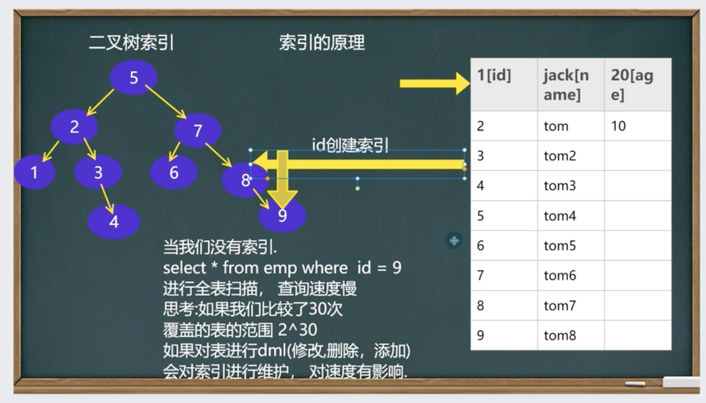

# 类型

* 主键索引，主键自动的为主索引(类型Primary key)
* 唯一索引(UNIQUE)
* 普通索引(INDEX)
* 全文索引(FULLTEXT)[适用于MySAM]
  * 一般开发，不使用mysql使用全文索引，全文搜索推荐Solr 和 ElasticSearch(ES)


# 创建索引

```mysql
# 添加索引
create [unique] index index_name on tbl_name(col_name[(length)][ase|desc], ...)

alter table table_name add index [index_name](index_col_name,...)

# 主键索引
alter table tab_name add primary key(col_name)
```


# 删除索引

```mysql
# 删除索引
drop index index_name on tab_name

# 删除主键索引
alter table tab_name drop primary key
```


# 查询索引

```mysql
-- 1
show index from tab_name

-- 2
show indexes from tab_name

-- 3
show keys from tab_name

-- 4
desc tab_name
```


# 规则

* 那些列上适合使用索引？
  * 较频繁的作为查询条件字段应该创建索引
  * select * from emp where empno = 1
* 唯一性太差的字段不适合单独创建索引，即使频繁作为查询条件
  * select * from emp where sex = '男'
* 更新非常频繁的字段不适合创建索引
  * select * from emp where logincpunt = 1
* 不会出现在WHERE子句中字段不该创建索引


# 原理

* 没有索引为什么会慢？
  * 因为全表扫描
* 使用索引为什么会快？
  * 因为形成一个索引的数据结构，比如二叉树

