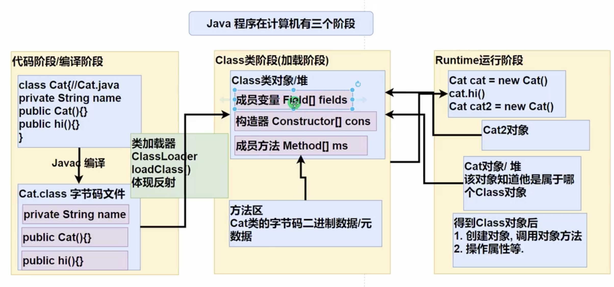

# 介绍

* 反射机制允许程序在执行期借助于ReeflectionAPI取得任何类的内部信息（比如成员变量，构造器，成员方法等等），并能操作对象的属性及方法。反射在设计模式和框架底层都会用到
* 加载完类之后，在堆中就产生了一个Class类型的对象（一个类只有一个Class对象），这个对象包含了类的完整结构信息。通过这个对象得到类的结构。这个对象就像一面镜子，透过这面镜子看到类的结构，所以，形象的称之为：反射

# 主要类

* java.lang.Class:代表一个类，Class对象表示某个类加载后在堆中的对象
* java.lang.reflect.Method: 代表类的方法
* java.lang.reflect.Field: 代表类的成员变量
* java.lang.reflect.Constructor: 代表类的构造方法

# 反射调用优化-关闭访问检查

* Method和Field、Constructor对象都有setAccessible()方法
* setAccessible作用时启动和禁用访问安全检查的开关
* 参数为true表示 反射的对象在使用时取消访问检查，提高反射的效率。参数为false则表示反射的对象执行访问检查