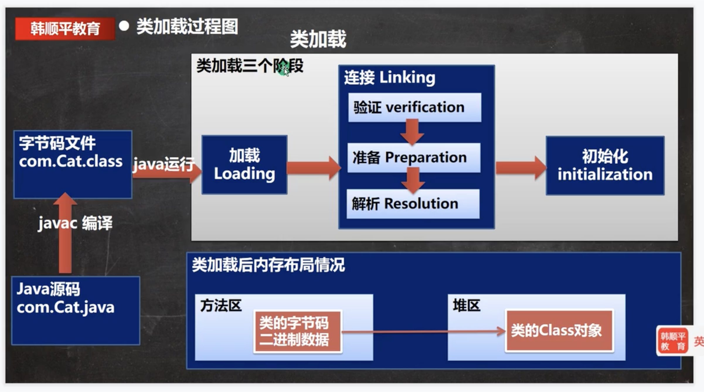
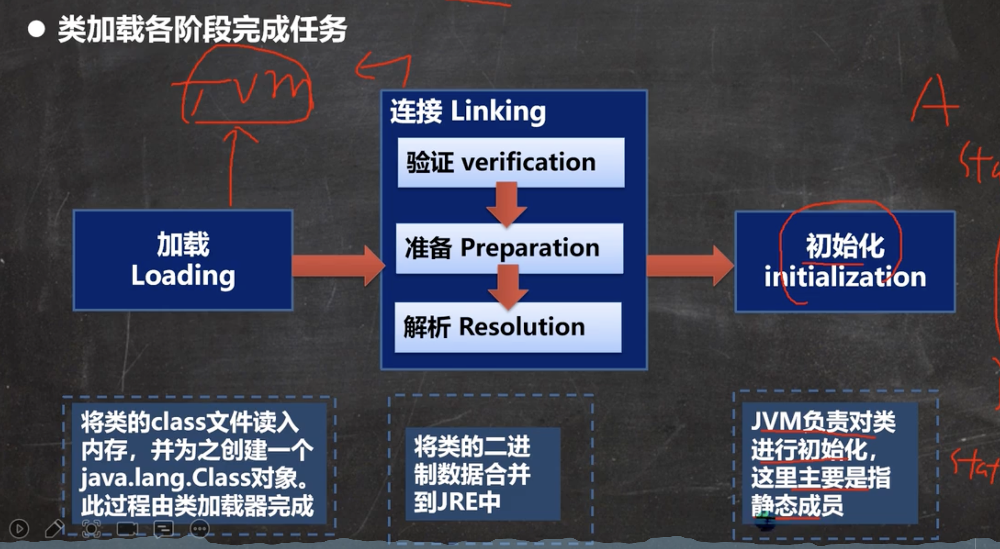

# 基本说明

反射机制是java实现动态语言的关键，也就是通过反射实现类的动态加载。

* 静态加载：编译时加载相关的类，如果没有则报错，依赖性太强
* 动态加载：运行时加载需要的类，如果运行时不用该类，即使不存在该类，也不会报错，降低了依赖性

```java
// 静态加载 编译时就会加载该类
// 依赖强
Dog dog = new Dog();
dog.cry();

// 动态加载 编译时不会加载该类
// 所以没有编写Dog类也不会报错，只有当动态加载该类时才报错
Class cls = Class.forName("Dog");
Object o = cls.newInstance();
Method m = cls.getMethod("cry");
m.invoko(o);
```


# 类加载时机

* 当创建对象时（new）//静态
* 当子类被加载时，父类也会被加载 //静态
* 调用类的静态成员时 //静态
* 通过反射 //动态


# 加载流程





* 加载阶段

  * JVM在该阶段的主要目的是将字节码从不同的数据源（class文件、jar包、网络...）转化成二进制字节流加载到内存中，并生成一个代表该类的java.lang.Class对象
  * 在方法区有类的字节码二进制数据，在堆中有类的Class对象

* 连接阶段

  * 验证阶段

    * 目的为了确保Class文件的字节流中包含的信息符合当前虚拟机的要求，并且不会危害虚拟机自身的安全。
    * 包括：文件格式验证（是否以魔数 oxcafebabe开头）、元数据验证、字节码验证和符号引用验证
    * 可以考虑使用 -Xverify:none 参数来关闭大部分的类验证措施，缩短虚拟机类加载的时间

  * 准备阶段

    * JVM会在该阶段对**静态变量**，分配内存并默认初始化（对应数据类型的默认初始值，如0、0L、null、false等）。这些变量所使用的内存都将在方法区中进行分配

      ```java
      class A {
        //属性-成员变量-字段
        //老韩分析类加载的链接阶段-准备 属性是如何处理
        //1. n1 是实例属性, 不是静态变量，因此在准备阶段，是不会分配内存
        //2. n2 是静态变量，分配内存 n2 是默认初始化 0 ,而不是20
        //3. n3 是static final 是常量, 他和静态变量不一样, 因为一旦赋值就不变 n3 = 30
        public int n1 = 10;
        public static  int n2 = 20;
        public static final  int n3 = 30;
      }
      ```

  * 解析阶段

    * 虚拟机将常量池内的符号引用替换成直接引用的过程

* 初始化

  * 到初始化阶段，才真正开始执行类中定义的Java程序代码，此阶段是执行<clinit>()方法的过程
  * <clinit>()方法是由编译器按语句在源文件中出现的顺序，依次自动收集类中的所有**静态变量**的赋值动作和静态代码块中的语句，并进行合并
  * 虚拟机会保证一个类<clinit>()方法在多线程环境中被正确地加锁、同步，如果多线程同时去初始化一个类，那么只会有一个线程区执行这个类的<clinit>()方法，其他线程都需要阻塞等待，直到活动线程执行<clinit>()方法完毕