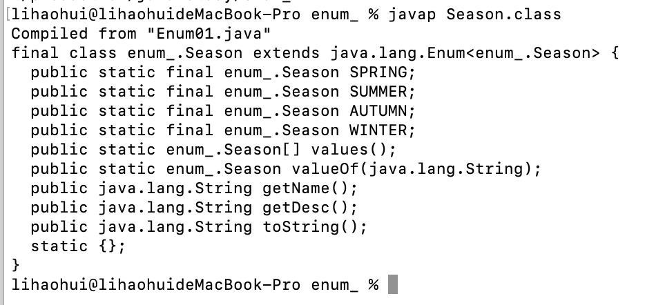

# 介绍

> 一组常量的集合

```java
enum 名称{
  XXX
}
```


# 自定义枚举类

```java
class Season {
    private String name;
    private String desc;

    public static final Season SPRING = new Season("春天","温暖");
    public static final Season SUMMER = new Season("夏天","炎热");
    public static final Season AUTUMN = new Season("秋天","凉爽");
    public static final Season WINTER = new Season("冬天","寒冷");

    private Season(String name, String desc) {
        this.name = name;
        this.desc = desc;
    }

    public String getName() {
        return name;
    }

    public String getDesc() {
        return desc;
    }

    @Override
    public String toString() {
        return "Season{" +
                "name='" + name + '\'' +
                ", desc='" + desc + '\'' +
                '}';
    }
}
```


# 关键字枚举类

```java
enum Season {
  // 简写
    SPRING("春天", "温暖"), SUMMER("夏天", "炎热"), AUTUMN("秋天", "凉爽"), WINTER("冬天", "寒冷");

    private String name;
    private String desc;

    private Season(String name, String desc) {
        this.name = name;
        this.desc = desc;
    }

    public String getName() {
        return name;
    }

    public String getDesc() {
        return desc;
    }

    @Override
    public String toString() {
        return "Season{" +
                "name='" + name + '\'' +
                ", desc='" + desc + '\'' +
                '}';
    }
}
```


# 注意事项

* 当我们使用enum关键字开发枚举类时，默认会继承Enum类

  

* 传统的public static final Season SPRING = new Season("春天","温暖");简化成SPRING("春天","温暖"); 这里必须知道，它调用的是哪个构造器
* 如果使用无参构造器 创建 枚举对象，则实参列表和小括号都可以省略
* 当有多个枚举对象，使用,间隔，最后有一个分号结尾
* 枚举对象必须放在枚举类的行首


# 练习

```java
public class EnumerationExercise01 {
    public static void main(String[] args) {
        Week[] weeks = Week.values();
        for (Week week : weeks) {
            System.out.println(week);
        }
    }
}


enum Week {
    MONDAY("星期一"), TUESDAY("星期二"), WEDNESDAY("星期三"), THURSDAY("星期四"), FRIDAY("星期五"),
    SATURDAY("星期六"), SUNDAY("星期日");
    private String name;

    Week(String name) {
        this.name = name;
    }

    @Override
    public String toString() {
        return name;
    }
}

/*
星期一
星期二
星期三
星期四
星期五
星期六
星期日
*/
```

