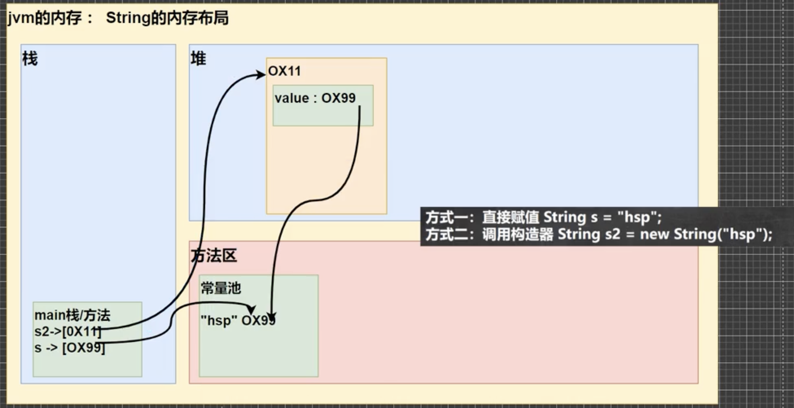
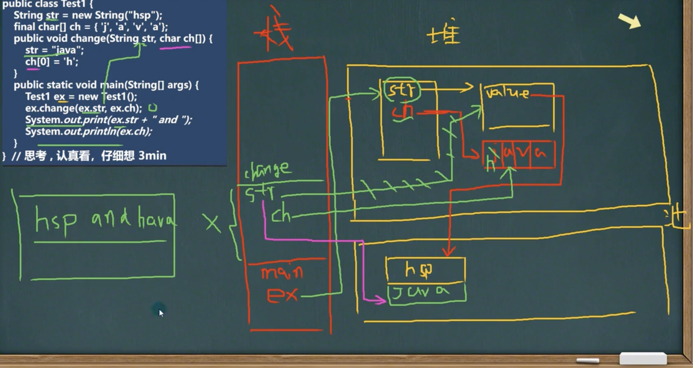

# 创建String对象

```java
// 方式一
String s = "hsp";

// 方式二
String s2 = new String("hsp");
```

* 方式一：先从常量池检查是否有"hsp"数据空间，如果有，直接指向；如果没有则重新创建，然后指向。s最终指向的常量池的空间地址

* 方式二：先从堆中创建空间，里面维护了value属性，指向常量池的"hsp"空间。如果常量池没有"hsp"，重写创建，如果有，直接通过value指向，最终指向的是堆中的空间地址

  


# 面试题

```java
String a = "hsp";
String b = new String("hsp");
System.out.println(a.euals(b)); // True
System.out.println(a == b); // False a->常量池 b->堆
System.out.println(a == b.intern());// True intern()返回常量池地址
System.out.println(b == b.intern());// False b->堆 b.intern() ->常量池
```

```java
Person p1 = new Person();
p1.name = "hspedu";
Person p2 = new Person();
p2.name = "hspedu";

System.out.println(p1.name.equals(p2.name)); // True 比较值
System.out.println(p1.name == p2.name); // True 这种方式都指向常量池
System.out.println(p1.name == "hspedu"); // True 都指向常量池

String s1 = new String("hspedu");
String s2 = new String("hspedu");
System.out.println(s1 == s2); // False 都指向不同的堆
```

```java
// 1.以下语句创建了几个对象？
String s1 = "hello";
s1 = "haha";
// 2个对象，s1->hello常量池，然后会去常量池找有没有haha，没有就创建再指向

// 2.以下语句创建了几个对象？
String a = "hello" + "haha";
// 1个对象，编译器底层会优化成 "hellohaha"
```

```java
//以下语句创建了几个对象？
String a = "hello";
String b = "abc";
String c = a + b;
// 3个对象
//两个变量相加其实这里的底层是 StringBuilder sb = new StringBuilder();
//sb.append(a);sb.append(b);
//sb在堆中，并且append是在原来的字符串基础上追加的
```



# 重要规则

* 常量相加，看的是池
* 变量相加，看的是堆

# String转基本类型

```java
String s = "123";
int i = Integer.parseInt(s);
double d = Double.parseDouble(s);
float f = Float.parseFloat(s);
long l = Long.parseLong(s);
short s1 = Short.parseShort(s);
byte b = Byte.parseByte(s);
boolean is = Boolean.parseBoolean("true");
```

# 基本类型转String

```java
int n1 = 10;
long n2 = 10L;
double n3 = 3.4;
float n4 = 3.4F;
String str1 = n1 + "";
String str2 = n2 + "";
String str3 = n3 + "";
String str4 = n4 + "";
String str5 = String.valueOf(n1);
```
